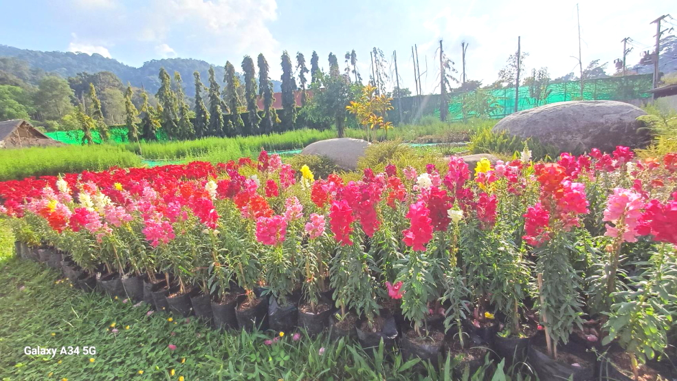
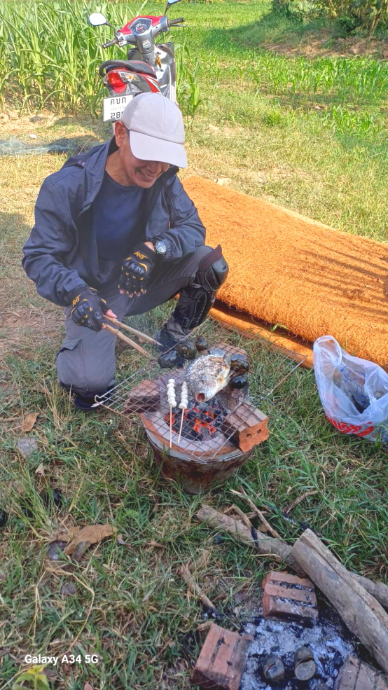
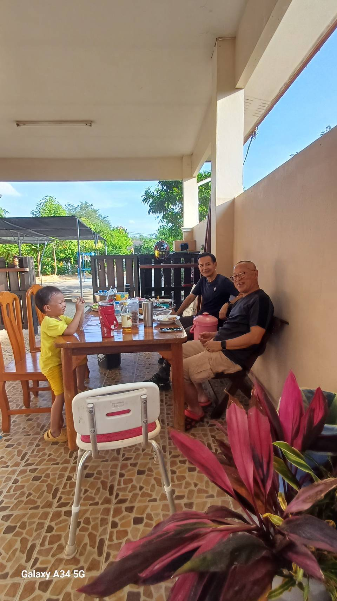
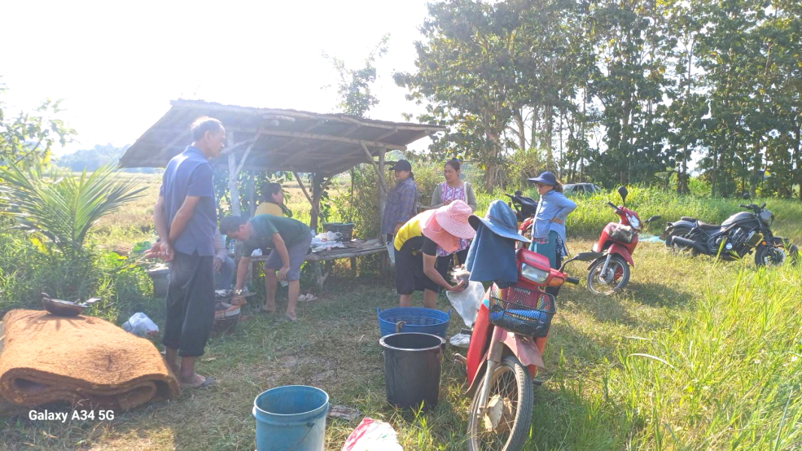
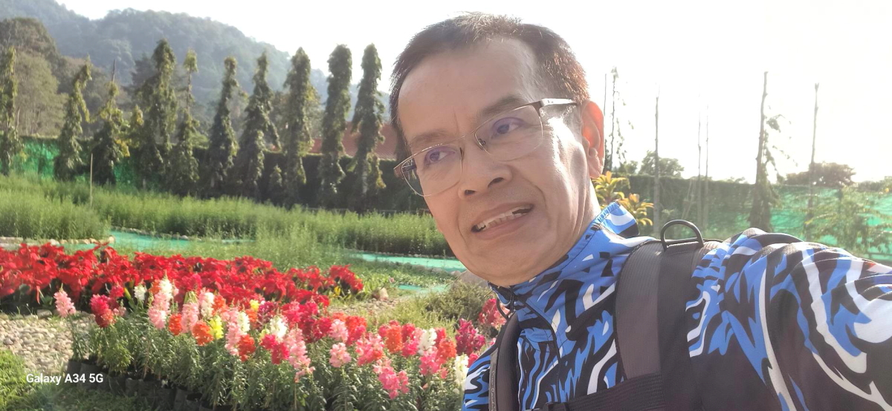
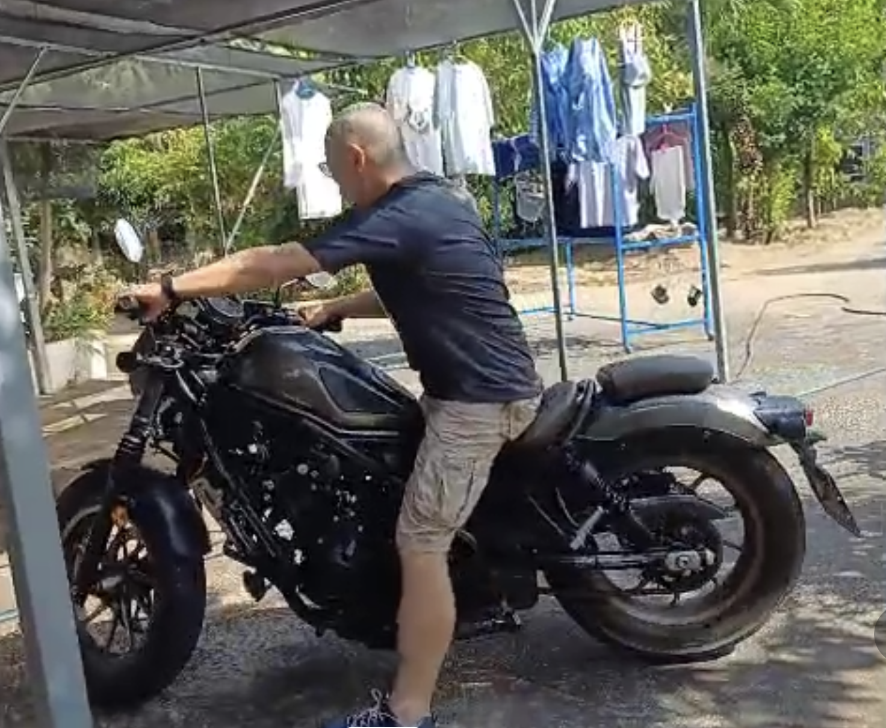
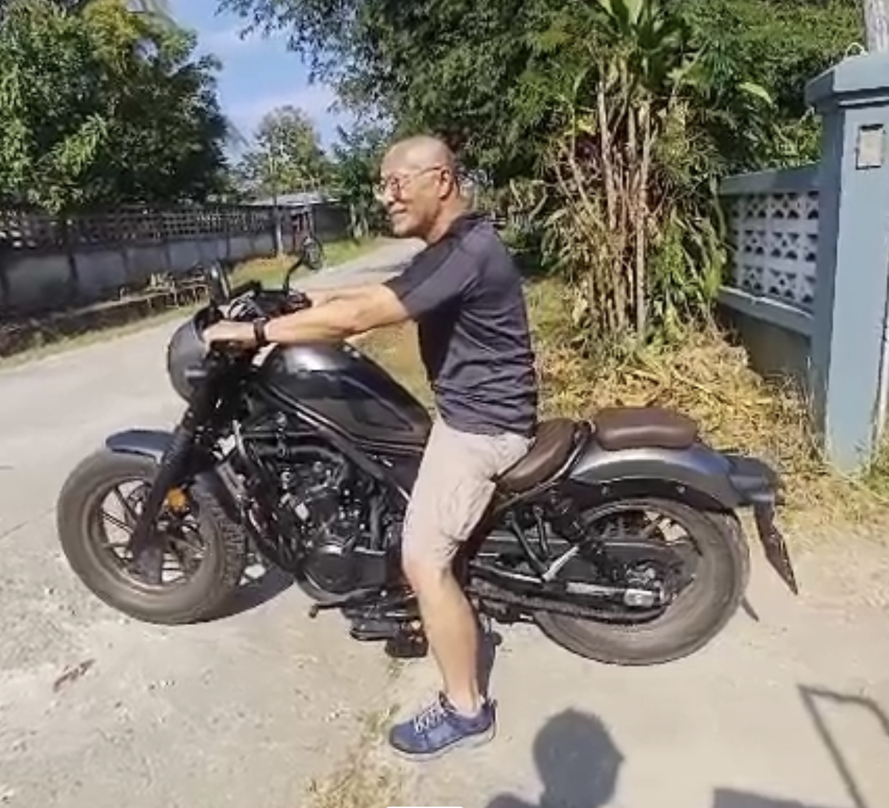

# 20241209_chiangrai

<html>
<head>

<meta charset="UTF-8">
<meta http-equiv="Content-Type" content="text/html; charset=UTF-8">
<meta http-equiv="X-UA-Compatible" content="IE=EmulateIE10" />
<meta http-equiv="X-UA-Compatible" content="IE=edge">

<!--ここから上はお決まりの定型文です-->

<!--ここからが表現の書式などを決めるcssという部分-->

<link href="https://cdnjs.cloudflare.com/ajax/libs/lightbox2/2.7.1/css/lightbox.css" rel="stylesheet">

</head>

<body>

モバイル端末をお使いの場合は、画面を横向きにすると
より見やすくご覧頂けます。

<!--ここ上は、ほぼそのまま使います！-->

<!--QRコードの挿入例-->

 アクセス用QRコード

<marquee direction="left" scrollamount="20" width="30%">(^_^)/~S,Hada</marquee>

<!--流れ文字の挿入例-->
<h1><marquee behavior="left">!!! 2024/12/08〜12/09 、チェンライの日常です !!!</marquee></h1>

                          

<!--ここから下が、本体部分-->

<h2>12月8日、朝一でトラックの荷台から砂が運び込まれました 猫の遊び場になってます</h2>
<iframe width="560" height="315" src="https://www.youtube.com/embed/nwOevt3PEGM?si=LbdKZ_1vYSO4Ztb5" title="YouTube video player" frameborder="0" allow="accelerometer; autoplay; clipboard-write; encrypted-media; gyroscope; picture-in-picture; web-share" referrerpolicy="strict-origin-when-cross-origin" allowfullscreen></iframe> 

<h2>この辺りは皆農家なので一家に一台、これがあります</h2>

<h2>重機を使うので砂山はあっという間に消えました</h2>

<h2>バナナは自生しているので、買う必要なし</h2>

<h2>庭に住むアヒルの一家</h2>
<iframe width="560" height="315" src="https://www.youtube.com/embed/WBWCyMUTFqM?si=k4O_rcSFbGLU2QTc" title="YouTube video player" frameborder="0" allow="accelerometer; autoplay; clipboard-write; encrypted-media; gyroscope; picture-in-picture; web-share" referrerpolicy="strict-origin-when-cross-origin" allowfullscreen></iframe> 

<h2>午後にはチェンマイから2時間かけて、いとこが遊びにきてくれました なんとHonda Rebel1100です！</h2>

<h2>大型バイクに乗るだけあって、装備はバッチリ</h2>

<h2>ヘルメットが転げ落ちないように、ほうきをうまく使ってます</h2>

<h2>いとこは50歳まで僧侶を務めた現在59歳、タイの富裕層ですね〜</h2>

<h2>バイク関連動画まとめ</h2>

<iframe width="560" height="315" src="https://www.youtube.com/embed/rDuC7A9vuEg?si=-Gml1TcsyVqkIjq2" title="YouTube video player" frameborder="0" allow="accelerometer; autoplay; clipboard-write; encrypted-media; gyroscope; picture-in-picture; web-share" referrerpolicy="strict-origin-when-cross-origin" allowfullscreen></iframe> 

<iframe width="560" height="315" src="https://www.youtube.com/embed/XjUnqamu0jQ?si=gq6YIEWLl9H1D_wZ" title="YouTube video player" frameborder="0" allow="accelerometer; autoplay; clipboard-write; encrypted-media; gyroscope; picture-in-picture; web-share" referrerpolicy="strict-origin-when-cross-origin" allowfullscreen></iframe> 

<h2>以下の2枚は画像クリックで動画再生します</h2>

<h2>12月9日、猛毒のヘビ、コブラの子供を退治！ 絶対に生き返らないよう、頭を完全に潰します</h2>

<h2>午後はいつものプール、入り口のお花は満開</h2>

<h2>料金支払いシステムがちょっと複雑で、毎回管理人さんのお世話になります 画像クリックで支払いシステムに飛びます</h2>

<h2>熱帯の強烈な日差しでコースローブの樹脂がパキパキ割れて、プールサイドに溜まります</h2>

<h2>プールから見えた、昼間のお月様</h2>

<h2>プール周辺の鉢植えのお花たちです</h2>

  

<h2>
<a href="https://torokoid.github.io/20241126_chiangrai/" target="_blank">Back to the menu page</a>
</h2>

   

   

         

  

      

<!--本体はここまで-->

<!--画面に空白地帯を作って、背景が見えるようにしています-->
                                              

<!-- フッタ -->
<footer>

Copyright 2024/12/09 S,Hada @ChiangRai

</footer>

<!--HPにさまざまなJavaScriptを呼び込むための書式-->

